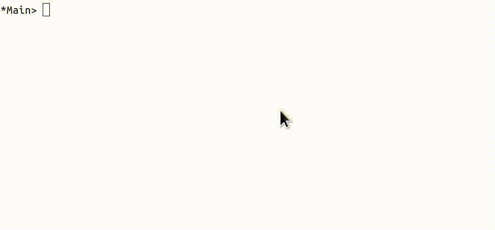

# reflex-vty  

## A library for building functional reactive terminal applications



Feature requests, pull requests, and other feedback are welcome and appreciated. This library
is still experimental, so big changes are possible!
### How to Build

#### With reflex-platform

Enter a nix-shell for the project:
```bash
git clone git@github.com:reflex-frp/reflex-platform
git clone git@github.com:reflex-frp/reflex-vty
cd reflex-vty
../reflex-platform/scripts/work-on ghc ./.
```

From within the nix-shell you can:
* Run the example: `cabal repl example`
* Load the library in the repl: `cabal repl reflex-vty`
* Build the example executable: `cabal build example`
* Build the docs: `cabal haddock`
* Run ghcid for immediate compiler feedback when you save a .hs file: `ghcid -c "cabal repl reflex-vty --ghc-options=-Wall"`
* etc.

#### With cabal

Please see the `tested-with` field of the cabal file for known-compatible versions of GHC.

From the reflex-vty project directory:

```bash
cabal new-configure
cabal new-build # to build the library and example
cabal new-repl # to enter a repl for the library
cabal new-repl example # to enter a repl for the example executable
```


